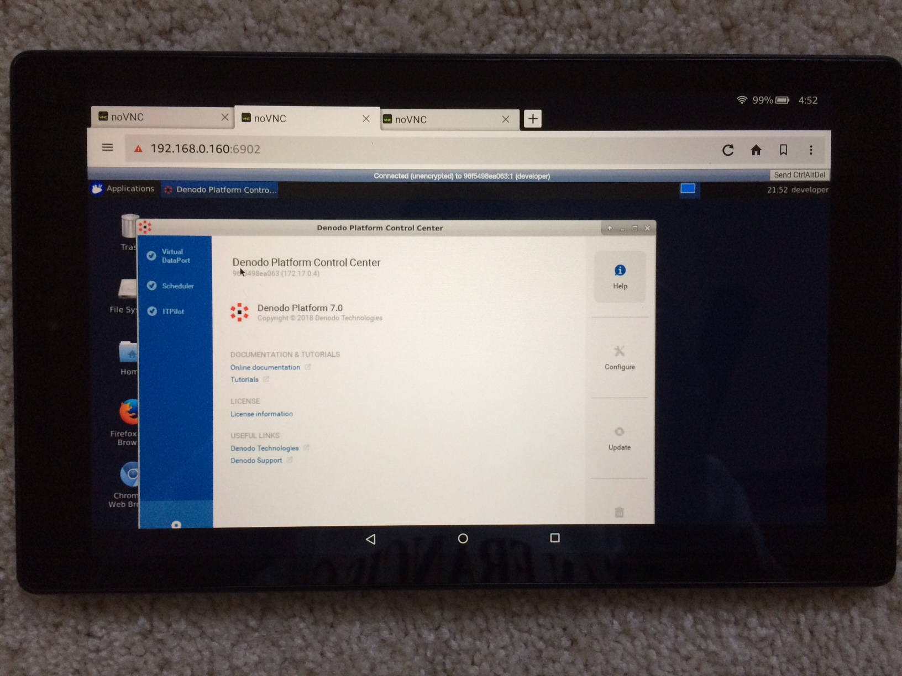
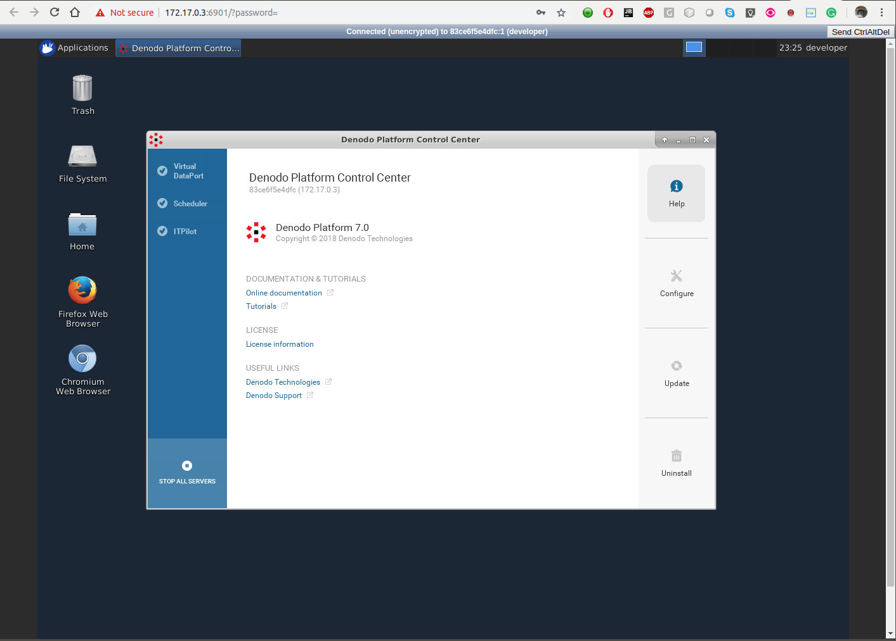

# Denodo Platform 7 (Express) in VNC / noVNC for Container Platform (Openshift, Kubernetes, DC/OS, Mesosphere, etc) 
[](https://microbadger.com/images/openkbs/denodo-vnc-docker "Get your own image badge on microbadger.com") [](https://microbadger.com/images/openkbs/denodo-vnc-docker "Get your own version badge on microbadger.com")

* Denodo Docker in VNC/noVNC + Java 8 (1.8.0_201) JDK + Maven 3.6 + Python 3.5 + PIP3 18.1 + + npm 3.5.2 + nodejs v4.2.6 + Gradle 5.1

# License Agreement
By using this image, you agree the [Oracle Java JDK License](http://www.oracle.com/technetwork/java/javase/terms/license/index.html).
This image contains [Oracle JDK 8](http://www.oracle.com/technetwork/java/javase/downloads/index.html). You must accept the [Oracle Binary Code License Agreement for Java SE](http://www.oracle.com/technetwork/java/javase/terms/license/index.html) to use this image.

# Components
* Denodo Docker
* java version "1.8.0_201"
  Java(TM) SE Runtime Environment (build 1.8.0_201-b09)
  Java HotSpot(TM) 64-Bit Server VM (build 25.201-b09, mixed mode)
* Apache Maven 3.6.0
* Python 3.5.2
* npm 6.4.1 + node v10.15.0 (from NodeSource official Node Distribution)
* Gradle 5.1
* VNC/noVNC for remote Desktop over Container Platform (Openshift, Kubernetes, etc.)
* Other tools: git wget unzip vim python python-setuptools python-dev python-numpy 

# Pre-requisites
You need two files to build and, after successful build, then you can launch Denodo Desktop.
* "Denodo Express Installer (generic) zip" file by downloading from https://community.denodo.com/express/download/
```
./denodo-express-install-7.0.zip
(be careful 7.0 not 7_0 for filename)
```
* "Denodo Express Free License" file from your free Denodo's account by [sign in onto your free Denodo account](https://community.denodo.com/login?destination=https%3A%2F%2Fcommunity.denodo.com%2Fdocs%2Fhtml%2Fbrowse%2F7.0%2Fplatform%2Finstallation%2Fpreinstallation_tasks%2Fdownload_an_installer%2Fdownload_an_installer) and save your license as the file name below:
```
./denodo-express-lic-7.0.lic
(be careful 7.0 not 7_0 for filename)
```

# Build
* (Note: this image will be 5.1 GB - huge!)
* Once you have the above two files, you can build the image. 
* During the build, it will install Denodo Express -- this might take about 15 ~ 20 minutes
```
./build.sh
```

# Run (recommended for easy-start)
Image is pulling from openkbs/denodo-vnc-docker
```
./run.sh
```

## Mobile devices and Desktop PC supported / tested:
* SmartPhones: tested ok! iPhone5 Safari works though phone screen size being too small vs the desired HD 1920x1080. It should work across all the smartphones with HTML5-capable brwosers. Hence, to access with small phone screen, run with VNC_RESOLUTION=800x600 (or adjust it to fit your phone's screen size)
* Tablets: tested ok! Amazon Fire with noVNC works!. It should work across all the tablets with HTML5-capable brwosers.
.
* Desktop PC or MacBook: tested ok! It should work across all PCs Desktop with HTML5-capable brwosers. 

## Connect to VNC Viewer/Client or noVNC (Browser-based VNC)
* connect via VNC viewer localhost:5901, default password: vncpassword
* connect via noVNC HTML5 full client: http://localhost:6901/vnc.html, default password: vncpassword
* connect via noVNC HTML5 lite client: http://localhost:6901/?password=vncpassword

Once it is up, the default password is "vncpassword" to access with your web browser:
```
http://<ip_address>:6901/vnc.html,
e.g.
=> Standalone Docker: http://localhost:6901/vnc.html
=> Openshift Container Platform: http://<route-from-openshift>/vnc.html
=> similarly for Kubernetes Container Platform: (similar to the Openshift above!)
```
# Run - Override VNC environment variables 
The following VNC environment variables can be overwritten at the docker run phase to customize your desktop environment inside the container. You can change those variables using configurations CLI or Web-GUI with OpenShift, Kubernetes, DC/OS, etc.
```
VNC_COL_DEPTH, default is 24 , e.g., change to 16,
    -e VNC_COL_DEPTH=16
VNC_RESOLUTION, default: 1920x1080 , e.g., change to 1024x800
    -e VNC_RESOLUTION=1280x1024
VNC_PW, default: vncpassword , e.g., change to MySpecial!(Password%)
    -e VNC_PW=MySpecial!(Password%)
```
# Screen (Desktop) Resolution
Two ways to change Screen resolutions.

## 1.) Modify ./run.sh file
```
#VNC_RESOLUTION="1280x1024"
VNC_RESOLUTION="1920x1080"
```

## 2.) Customize Openshift or Kubernetes container run envionrment
```
Set up, say, VNC_RESOLUTION with value 1920x1280
```

# Base the image to build add-on components

```Dockerfile
FROM openkbs/jdk-mvn-py3-vnc
```

# Configurations (Optional)
If you run "./run.sh" instead of "docker-compose up", you don't have to do anything as below.

* The container uses a default "/workspace" folder. 
* The script "./run.sh" will re-use or create the local folder in your $HOME directory with the path below to map into the docker's internal "/workspace" folder.
```
$HOME/data_docker/denodo-vnc-docker/workspace
```
The above configuration will ensure all your projects created in the container's "/workspace" being "persistent" in your local folder, "$HOME/data_docker/denodo-vnc-docker/workspace", for your repetitive restart docker container.

# See Also - Denodo Platform 7 in two flavors X11 and VNC/noVNC
* [openkbs/denodo-docker for Standalone Docker](https://hub.docker.com/r/openkbs/denodo-docker/)
* [openkbs/denodo-vnc-docker for OpenShift, Kubernetes, Mesophere, DC/OS](https://hub.docker.com/r/openkbs/denodo-vnc-docker/)

# See Also Other docker-based IDE
* [openkbs/docker-atom-editor](https://hub.docker.com/r/openkbs/docker-atom-editor/)
* [openkbs/eclipse-photon-docker](https://hub.docker.com/r/openkbs/eclipse-photon-docker/)
* [openkbs/intellj-docker](https://hub.docker.com/r/openkbs/intellij-docker/)
* [openkbs/netbeans9-docker](https://hub.docker.com/r/openkbs/netbeans9-docker/)
* [openkbs/netbeans](https://hub.docker.com/r/openkbs/netbeans/)
* [openkbs/papyrus-sysml-docker](https://hub.docker.com/r/openkbs/papyrus-sysml-docker/)
* [openkbs/pycharm-docker](https://hub.docker.com/r/openkbs/pycharm-docker/)
* [openkbs/scala-ide-docker](https://hub.docker.com/r/openkbs/scala-ide-docker/)
* [openkbs/sublime-docker](https://hub.docker.com/r/openkbs/sublime-docker/)
* [openkbs/webstorm-docker](https://hub.docker.com/r/openkbs/webstorm-docker/)

# Other Resources
* [Talend - Data Integration Platform](https://www.talend.com/)
* [JBoss Tools Integration Stacks 4.6.0.Final](https://tools.jboss.org/downloads/jbosstools_is/photon/4.6.0.Final.html#update_site)
* [Containerize Teiid linked with MariaDB](https://developer.jboss.org/wiki/QuickstartExampleWithDockerizedTeiid)
* [Teiid Downloads](http://teiid.jboss.org/downloads/)
* [Teiid Designer 11.1 with Eclipse Oxygen](http://teiiddesigner.jboss.org/designer_summary/downloads.html)
* [Teiid Cloud - Data Virtualization Services](http://teiid.io/teiid_cloud/)
* [Deploying Teiid VDB](http://teiid.github.io/teiid-documents/master/content/admin/Deploying_VDBs.html)
* [JBoss Tools Integration Stack 4.6.0.Final](https://tools.jboss.org/downloads/jbosstools_is/photon/4.6.0.Final.html)

# Releases information
```
root@1b69cb491038:/usr# ./printVersions.sh 
+ echo JAVA_HOME=/usr/java
JAVA_HOME=/usr/java
+ java -version
java version "1.8.0_201"
Java(TM) SE Runtime Environment (build 1.8.0_201-b09)
Java HotSpot(TM) 64-Bit Server VM (build 25.201-b09, mixed mode)
+ mvn --version
Apache Maven 3.6.0 (97c98ec64a1fdfee7767ce5ffb20918da4f719f3; 2018-10-24T18:41:47Z)
Maven home: /usr/apache-maven-3.6.0
Java version: 1.8.0_201, vendor: Oracle Corporation, runtime: /usr/jdk1.8.0_201/jre
Default locale: en_US, platform encoding: ANSI_X3.4-1968
OS name: "linux", version: "4.15.0-43-generic", arch: "amd64", family: "unix"
+ python -V
Python 2.7.12
+ python3 -V
Python 3.5.2
+ pip --version
pip 18.1 from /usr/local/lib/python3.5/dist-packages/pip (python 3.5)
+ pip3 --version
pip 18.1 from /usr/local/lib/python3.5/dist-packages/pip (python 3.5)
+ gradle --version

------------------------------------------------------------
Gradle 5.1.1
------------------------------------------------------------

Build time:   2019-01-10 23:05:02 UTC
Revision:     3c9abb645fb83932c44e8610642393ad62116807

Kotlin DSL:   1.1.1
Kotlin:       1.3.11
Groovy:       2.5.4
Ant:          Apache Ant(TM) version 1.9.13 compiled on July 10 2018
JVM:          1.8.0_201 (Oracle Corporation 25.201-b09)
OS:           Linux 4.15.0-43-generic amd64

+ npm -v
6.4.1
+ node -v
v10.15.0
+ cat /etc/lsb-release /etc/os-release
DISTRIB_ID=Ubuntu
DISTRIB_RELEASE=16.04
DISTRIB_CODENAME=xenial
DISTRIB_DESCRIPTION="Ubuntu 16.04.3 LTS"
NAME="Ubuntu"
VERSION="16.04.3 LTS (Xenial Xerus)"
ID=ubuntu
ID_LIKE=debian
PRETTY_NAME="Ubuntu 16.04.3 LTS"
VERSION_ID="16.04"
HOME_URL="http://www.ubuntu.com/"
SUPPORT_URL="http://help.ubuntu.com/"
BUG_REPORT_URL="http://bugs.launchpad.net/ubuntu/"
VERSION_CODENAME=xenial
UBUNTU_CODENAME=xenial

```
